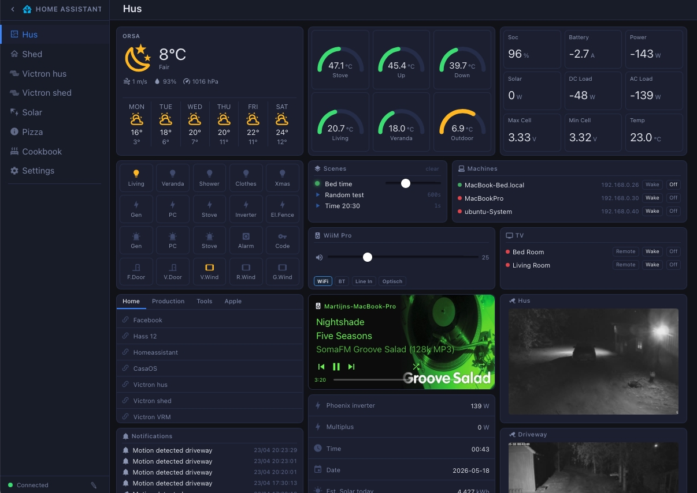

# MQTT Dashboard

A local-first, MQTT-driven home automation dashboard built with **Vue 3 + Express**. Designed to run fully off-grid with zero cloud dependencies.



## Features

- **Real-time MQTT data** — sensors, switches, gauges, indicators all driven by MQTT topics
- **Weather card** — 7-day forecast via Open-Meteo (no API key needed)
- **Camera cards** — live MJPEG streams with proxy support
- **Music Assistant** — full player control with queue, browse, radio tabs and audio announcements; album art via Last.fm lookup for radio streams
- **Notification system** — persistent log, overlay with sounds, edge-triggered MQTT events
  - Plays sounds locally and via Music Assistant on all active players
  - Edge detection: fires only when a value *crosses* a threshold (not on every message)
  - String equality trigger (`= ON`) for binary sensors (e.g. motion detection)
- **Victron integration** — solar, battery, inverter data via MQTT; Victron GX GUI v2 proxied and made available outside the local network via Caddy
- **Home Assistant integration** — entity control via HA REST API
- **URL launcher** — categorised links with tab navigation
- **Recipe viewer** — stored locally, no external services
- **Mobile layout** — dedicated responsive view at `/m/<page-slug>` with per-card mobile visibility and ordering
- **Edit mode** — all cards support drag-and-drop repositioning and grid resizing directly in the browser; add, remove and configure cards without touching config files
- **Philips TV remote** — dedicated full-screen remote page at `/remote`, optimised for iPhone (no sidebar, large touch targets)
- **IR remote system** — register ESP32 IR transceivers as transmitters, then register TV / soundbar devices against them; learn codes directly from physical remotes via MQTT; open styled remotes as an overlay on desktop or full-screen on mobile
- **WLED integration** — register WLED dimmers via the `/wled` device page; control them with the WLED card; color presets managed via the Color card
- **Theme system** — create, edit and apply custom UI themes; live preview while editing colors and fonts; themes persist across sessions
- **Caddy reverse proxy** — HTTPS with basic auth, WebSocket support

## Stack

| Layer | Tech |
|---|---|
| Frontend | Vue 3, Vite, Pinia, Vue Router |
| Backend | Node.js, Express |
| Realtime | MQTT (via mqtt.js), WebSocket |
| Proxy | Caddy |

## Getting Started

### 1. Clone

```bash
git clone https://github.com/yourusername/mqtt-dashboard.git
cd mqtt-dashboard
```

### 2. Configure

```bash
cp config/mqtt.example.json config/mqtt.json
cp config/homeassistant.example.json config/homeassistant.json
```

Edit both files with your broker and HA credentials. Then create your first page by copying the example:

```bash
cp config/pages/example-page.json config/pages/living-room.json
```

### 3. Install & Run

```bash
# Server
cd server && npm install
node index.js

# Frontend (dev)
cd frontend && npm install
npm run dev

# Frontend (production build)
npm run build
# Serve dist/ via Caddy or any static server
```

### 4. Sounds (optional)

Place `.mp3` files in:
- `sounds/alert_sounds/` — alert tones
- `sounds/speech_sounds/` — speech/TTS files

These are served at `/sounds/` and used by the notification system.

## Card Types

| Type | Description |
|---|---|
| `sensor` | Numeric MQTT value with unit |
| `gauge` | Arc gauge with min/max/color thresholds |
| `switch` | Toggle via MQTT or Home Assistant |
| `indicator` | On/off state indicator |
| `button` | Publish a fixed MQTT payload |
| `text` | Display any MQTT string value |
| `weather` | Current conditions + 7-day forecast |
| `camera` | MJPEG stream with snapshot |
| `entities` | List of HA entities with state |
| `grid` | Mini sensor/switch grid |
| `musicassistant` | Music Assistant player card with album art |
| `notification` | Persistent notification log |
| `url` | Categorised link launcher |
| `webpage` | Embedded iframe |
| `recipe` | Local recipe viewer |
| `machine` | Network machines — online status, Wake on LAN, shutdown |
| `tv` | Network TVs — online status, Wake on LAN, power off |
| `color` | RGBW color preset manager with categories (used by WLED card) |
| `wled` | WLED LED strip control — per-device lightbulb toggle with color preset |
| `wiim` | WiiM / LinkPlay streamer — volume slider and input selector with custom labels |
| `scenes` | Lighting scene sequencer — play ordered sequences of dimmer, fade, random and HA light steps |
| `theme` | UI theme manager — create and apply custom color and font themes with live preview |
| `irtransmitter` | ESP32 IR transmitter registry — add, edit and delete transmitters (id, name, IP) |
| `irreceiver` | IR device registry — register TVs and soundbars, assign a transmitter, learn commands from a physical remote, open a styled remote control |

## Site Dashboard Integration

The `machine` and `tv` card types consume retained MQTT messages published by [Site Dashboard](https://github.com/netbox123/SIte_Dashboard).

Configure the card with the matching `mqtt_prefix`:

| Card type | `mqtt_prefix` |
|---|---|
| `machine` | `site_dashboard/machines` |
| `tv` | `site_dashboard/tvs` |

The card auto-discovers all devices by scanning received topics matching `{prefix}/+/state`. Wake and Off button clicks publish to `{prefix}/{id}/command`.

## Notification Events

Notification events trigger automatically based on MQTT topic values:

- `>` / `<` — numeric threshold crossing (edge-triggered)
- `=` — string equality transition (e.g. `ON` for motion sensors)

Each event links to a notification rule that defines the title, message, and sounds to play.

## Configuration Files

| File | Description |
|---|---|
| `config/mqtt.json` | MQTT broker connection settings |
| `config/homeassistant.json` | HA URL and long-lived token |
| `config/pages/*.json` | Page and card layouts |
| `config/urls.json` | URL launcher categories and links |
| `config/colors.json` | RGBW color preset categories and values |
| `config/wled_devices.json` | Registered WLED dimmers (id, name, IP) |
| `config/themes.json` | UI themes (auto-generated via Theme card) |
| `config/notifications.json` | Notification history log (auto-generated) |
| `config/notification_events.json` | MQTT trigger rules (auto-generated) |
| `config/scenes.json` | Lighting scenes (auto-generated via UI) |
| `config/ir_devices.json` | Registered ESP32 IR transmitters (auto-generated via UI) |
| `config/ir_receivers.json` | IR device configs — commands per device keyed by `config_key` (auto-generated via UI) |
| `config/remotes.json` | Remote type definitions (type, name, brand) |
| `config/remotes/*.json` | Per-type key definitions for remote layouts |

## WLED Integration

WLED dimmers are registered in `config/wled_devices.json`:

```json
[
  { "id": "c18cbc", "name": "Living Room Strip", "ip": "192.168.0.61" }
]
```

The `id` is the last part of the WLED MQTT topic (e.g. `wled/c18cbc/`). The server subscribes to `wled/#` automatically and forwards all messages to the frontend via WebSocket.

**Workflow:**
1. Go to the **WLED** page in the sidebar to register your dimmers
2. Use the **Color card** to create RGBW preset categories and values
3. Add a **WLED card** to any dashboard page, select devices and assign a color preset to each
4. Click the lightbulb icon on the card to toggle the strip on/off using the configured preset

Color changes publish a JSON payload to `wled/{id}/api`:
```json
{ "on": true, "bri": 255, "seg": [{ "col": [[R, G, B, W]] }] }
```

## Scenes

The **Scenes card** lets you build and play multi-step lighting sequences across WLED dimmers and Home Assistant lights.

### Scene items

| Item type | Description |
|---|---|
| **Set dimmer** | Instantly sets all scene WLED devices to an RGBW color (`transition: 0`) |
| **Fade** | Smoothly fades from the current color to a target RGBW color; calculated in 1-second steps with `transition: 9` (no WLED 65 s limit) |
| **Random** | Continuously fades between randomly generated RGBW colors. Choose which channels (R/G/B/W) randomize, set a base color, a **speed** (seconds between targets) and a **random** deviation (±1–255). Interpolated in 1-second steps for smooth transitions |
| **Set HA light** | Calls the HA service API to turn one or more HA lights/switches ON or OFF |

### Scene queue

Up to two scenes can be active simultaneously — one playing (green dot + live progress bar) and one paused (red dot + frozen progress bar at the paused position).

When a second scene is triggered:
- The playing scene is **paused** — its elapsed position and WLED colors are saved
- The new scene starts from the beginning
- When the new scene finishes, the paused scene **resumes from where it stopped**: skipped items are skipped, in-progress items continue, and the WLED dimmers are snapped back to their saved colors before resuming

Triggering a third scene while both slots are full is silently denied — the queue stays unchanged.

### Triggers

Each scene can be set to fire automatically:

- **MQTT** — fires on an edge-detected MQTT topic value (same `>` / `<` / `=` logic as notification events)
- **Time** — fires at a specific time (24 h), with per-day-of-week checkboxes (MTWTFSS); scheduled server-side, aligned to the clock minute

### Workflow

1. Add a **Scenes card** to a dashboard page
2. Click **+** to create a scene — give it a name, select WLED devices, and optionally configure a trigger
3. Click the scene name to open the scene editor and add items (Set dimmer / Fade / Set HA light)
4. Click the play button on any scene row to run it immediately

## WiiM Integration

The `wiim` card controls any WiiM or LinkPlay-based streamer over its local HTTPS API. Configure the card with the device IP address.

| Card field | Description |
|---|---|
| `title` | Display name |
| `ip` | Device IP address (e.g. `192.168.0.22`) |

The card polls the device every 3 seconds for live volume and input state. Volume changes are debounced and sent immediately on release. Supported inputs: WiFi, Bluetooth, Line In, Optical. Input button labels can be customised per card via the edit dialog.

The server proxies all requests to `https://{ip}/httpapi.asp` (bypassing the self-signed certificate) to avoid CORS issues in the browser.

## Theme System

The **Theme card** lets you create and manage custom UI themes. Each theme defines the full set of CSS variables used by the dashboard — background colors, text colors, accent colors, font family and font size.

- **Live preview** — changes apply instantly to the dashboard as you edit
- **Revert on cancel** — closing the dialog without saving restores the previous appearance
- **Persist on apply** — applied theme is saved to `localStorage` and restored on next load with no flash
- **Fonts bundled** — Inter, Roboto, Open Sans, Lato, Nunito and Ubuntu are served directly from the app with no CDN dependency

## IR Remote System

Control TVs and soundbars via ESP32 IR transceivers — no cloud, no app, just MQTT.

### Hardware

Any ESP32 with an IR LED and TSOP-type IR receiver, flashed with ESPHome. A ready-to-use ESPHome template is in [`esphome/ir-board-esp32.yaml`](esphome/ir-board-esp32.yaml) — copy it, replace the `XX` placeholders with your board number and IP, and flash via OTA.

MQTT topics used by each board:

| Topic | Direction | Payload |
|---|---|---|
| `ir/{id}/transmit` | Dashboard → ESP32 | Raw IR timing array, e.g. `[2697,-865,476,...]` |
| `ir/{id}/learned` | ESP32 → Dashboard | Raw IR timing array of any received signal |

The board continuously publishes to `ir/{id}/learned` for every IR signal it receives. The dashboard captures it during the 33-second learn window when a Learn button is active.

> **Pins (AliExpress IR board):** IR TX → GPIO4, IR RX → GPIO14 (inverted, pull-up)

> **MQTT credentials:** add `mqtt_username` and `mqtt_password` to your ESPHome `secrets.yaml`, matching `config/mqtt.json`.

### Setup

**Step 1 — Register transmitters**

Add an `irtransmitter` card to any dashboard page. Click **+** to register each ESP32 module with a name and ID. The ID must match the hostname used in the ESPHome YAML (e.g. `ir-47`).

**Step 2 — Register IR devices**

Add an `irreceiver` card (give it a unique `config_key` in the card settings). Click **+** to register a device (TV or soundbar):

- **Name** — display name (e.g. "Living Room TV")
- **Type** — `philips_tv`, `lg_tv`, or `soundbar`
- **Transmitter** — select which ESP32 will send IR to this device
- **Commands** — one row per button; enter a code manually or click **Learn** to capture it from the original remote

**Learn flow:**
1. Click **Learn** next to a command button — the button pulses for 33 seconds
2. Point the original remote at the ESP32 and press the button
3. The captured code auto-fills and the pulse stops

### Using the remote

Click **Remote** on any registered device to open the remote control:

- **Desktop** — opens as a centered overlay with a dark styled shell
- **Mobile** — opens full-screen (tap **← Back** to return)

The **Remotes** page (accessible from the sidebar) provides a tab-based interface: top tabs switch between remote types (Philips TV, LG TV, Soundbar), and receiver tabs inside the remote shell switch between devices assigned to each transmitter.

### Supported remote layouts

| Type | Buttons |
|---|---|
| `philips_tv` | Power, play controls, source, D-pad + OK, back/options, vol/home, color buttons |
| `lg_tv` | Power, source/mute/settings, D-pad + OK, back/home/info, vol/ch, play controls |
| `soundbar` | Power, volume up/down, mute |

## License

MIT
