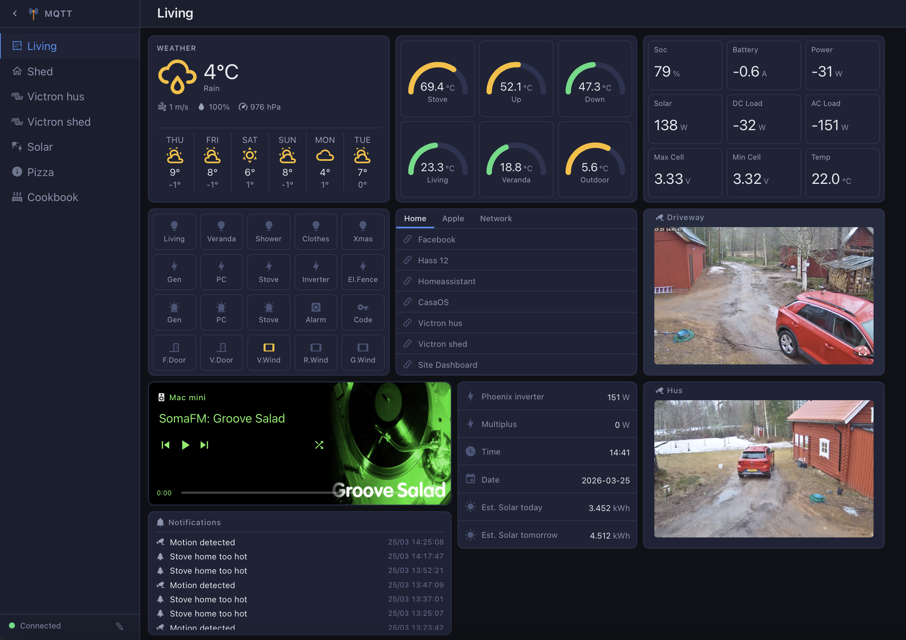

# MQTT Dashboard

A local-first, MQTT-driven home automation dashboard built with **Vue 3 + Express**. Designed to run fully off-grid with zero cloud dependencies.



## Features

- **Real-time MQTT data** — sensors, switches, gauges, indicators all driven by MQTT topics
- **Weather card** — 7-day forecast via Open-Meteo (no API key needed)
- **Camera cards** — live MJPEG streams with proxy support
- **Music Assistant** — full player control with queue, browse, radio tabs and audio announcements
- **Notification system** — persistent log, overlay with sounds, edge-triggered MQTT events
  - Plays sounds locally and via Music Assistant on all active players
  - Edge detection: fires only when a value *crosses* a threshold (not on every message)
  - String equality trigger (`= ON`) for binary sensors (e.g. motion detection)
- **Victron integration** — solar, battery, inverter data via MQTT; Victron GX GUI v2 proxied and made available outside the local network via Caddy
- **Home Assistant integration** — entity control via HA REST API
- **URL launcher** — categorised links with tab navigation
- **Recipe viewer** — stored locally, no external services
- **Mobile layout** — dedicated responsive view at `/m/<page-slug>` with per-card mobile visibility and ordering
- **Edit mode** — all cards support drag-and-drop repositioning and grid resizing directly in the browser; add, remove and configure cards without touching config files
- **Philips TV remote** — dedicated full-screen remote page at `/remote`, optimised for iPhone (no sidebar, large touch targets)
- **WLED integration** — register WLED dimmers via the `/wled` device page; control them with the WLED card; color presets managed via the Color card
- **Caddy reverse proxy** — HTTPS with basic auth, WebSocket support

## Stack

| Layer | Tech |
|---|---|
| Frontend | Vue 3, Vite, Pinia, Vue Router |
| Backend | Node.js, Express |
| Realtime | MQTT (via mqtt.js), WebSocket |
| Proxy | Caddy |

## Getting Started

### 1. Clone

```bash
git clone https://github.com/yourusername/mqtt-dashboard.git
cd mqtt-dashboard
```

### 2. Configure

```bash
cp config/mqtt.example.json config/mqtt.json
cp config/homeassistant.example.json config/homeassistant.json
```

Edit both files with your broker and HA credentials. Then create your first page by copying the example:

```bash
cp config/pages/example-page.json config/pages/living-room.json
```

### 3. Install & Run

```bash
# Server
cd server && npm install
node index.js

# Frontend (dev)
cd frontend && npm install
npm run dev

# Frontend (production build)
npm run build
# Serve dist/ via Caddy or any static server
```

### 4. Sounds (optional)

Place `.mp3` files in:
- `sounds/alert_sounds/` — alert tones
- `sounds/speech_sounds/` — speech/TTS files

These are served at `/sounds/` and used by the notification system.

## Card Types

| Type | Description |
|---|---|
| `sensor` | Numeric MQTT value with unit |
| `gauge` | Arc gauge with min/max/color thresholds |
| `switch` | Toggle via MQTT or Home Assistant |
| `indicator` | On/off state indicator |
| `button` | Publish a fixed MQTT payload |
| `text` | Display any MQTT string value |
| `weather` | Current conditions + 7-day forecast |
| `camera` | MJPEG stream with snapshot |
| `entities` | List of HA entities with state |
| `grid` | Mini sensor/switch grid |
| `musicassistant` | Music Assistant player card |
| `notification` | Persistent notification log |
| `url` | Categorised link launcher |
| `webpage` | Embedded iframe |
| `recipe` | Local recipe viewer |
| `machine` | Network machines — online status, Wake on LAN, shutdown |
| `tv` | Network TVs — online status, Wake on LAN, power off |
| `color` | RGBW color preset manager with categories (used by WLED card) |
| `wled` | WLED LED strip control — per-device lightbulb toggle with color preset |
| `wiim` | WiiM / LinkPlay streamer — volume slider and input selector |

## Site Dashboard Integration

The `machine` and `tv` card types consume retained MQTT messages published by [Site Dashboard](https://github.com/netbox123/SIte_Dashboard).

Configure the card with the matching `mqtt_prefix`:

| Card type | `mqtt_prefix` |
|---|---|
| `machine` | `site_dashboard/machines` |
| `tv` | `site_dashboard/tvs` |

The card auto-discovers all devices by scanning received topics matching `{prefix}/+/state`. Wake and Off button clicks publish to `{prefix}/{id}/command`.

## Notification Events

Notification events trigger automatically based on MQTT topic values:

- `>` / `<` — numeric threshold crossing (edge-triggered)
- `=` — string equality transition (e.g. `ON` for motion sensors)

Each event links to a notification rule that defines the title, message, and sounds to play.

## Configuration Files

| File | Description |
|---|---|
| `config/mqtt.json` | MQTT broker connection settings |
| `config/homeassistant.json` | HA URL and long-lived token |
| `config/pages/*.json` | Page and card layouts |
| `config/urls.json` | URL launcher categories and links |
| `config/colors.json` | RGBW color preset categories and values |
| `config/wled_devices.json` | Registered WLED dimmers (id, name, IP) |
| `config/notifications.json` | Notification history log (auto-generated) |
| `config/notification_events.json` | MQTT trigger rules (auto-generated) |

## WLED Integration

WLED dimmers are registered in `config/wled_devices.json`:

```json
[
  { "id": "c18cbc", "name": "Living Room Strip", "ip": "192.168.0.61" }
]
```

The `id` is the last part of the WLED MQTT topic (e.g. `wled/c18cbc/`). The server subscribes to `wled/#` automatically and forwards all messages to the frontend via WebSocket.

**Workflow:**
1. Go to the **WLED** page in the sidebar to register your dimmers
2. Use the **Color card** to create RGBW preset categories and values
3. Add a **WLED card** to any dashboard page, select devices and assign a color preset to each
4. Click the lightbulb icon on the card to toggle the strip on/off using the configured preset

Color changes publish a JSON payload to `wled/{id}/api`:
```json
{ "on": true, "bri": 255, "seg": [{ "col": [[R, G, B, W]] }] }
```

## WiiM Integration

The `wiim` card controls any WiiM or LinkPlay-based streamer over its local HTTPS API. Configure the card with the device IP address.

| Card field | Description |
|---|---|
| `title` | Display name |
| `ip` | Device IP address (e.g. `192.168.0.22`) |

The card polls the device every 3 seconds for live volume and input state. Volume changes are debounced and sent immediately on release. Supported inputs: WiFi, Bluetooth, Line In, Optical, Coaxial.

The server proxies all requests to `https://{ip}/httpapi.asp` (bypassing the self-signed certificate) to avoid CORS issues in the browser.

## License

MIT
